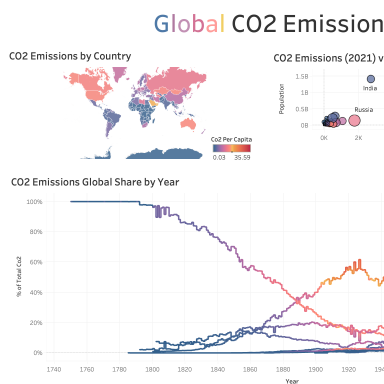
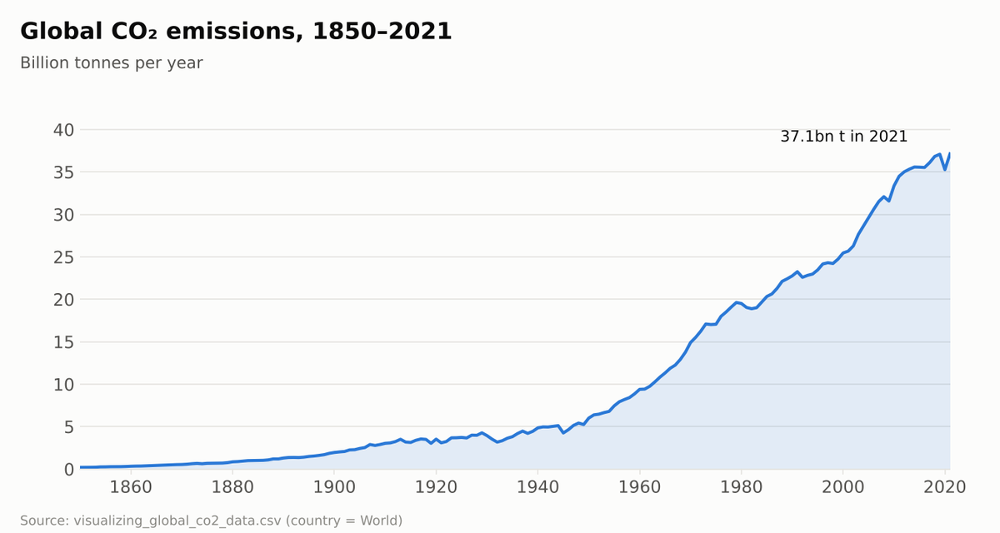
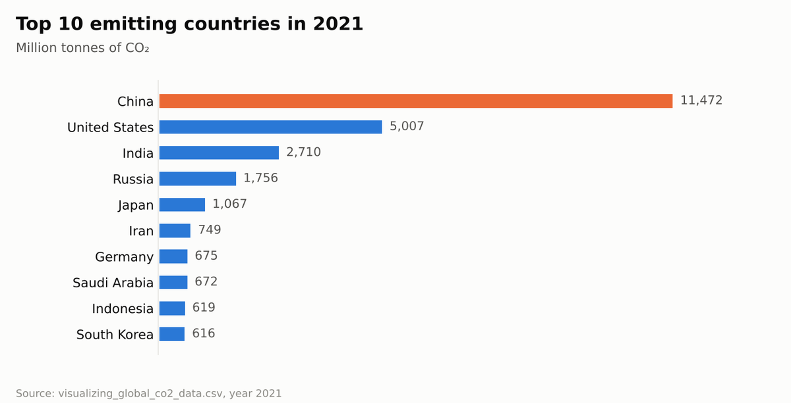

# 🌍 Global CO₂ Emissions Dashboard

An interactive **Tableau** dashboard exploring carbon dioxide emissions around the world — which countries emit the most, how emissions have changed over time, and how they relate to population and economic output.


## 📋 Overview

Climate data is huge and hard to read in a table. This dashboard turns more than 50,000 rows of emissions data into a single view where you can compare countries and see long-term trends.

## 📈 Visuals

The first image is the dashboard preview stored in the workbook. Charts built with Python (pandas + matplotlib) from the data files in this repo.

<p align="center"></p>
<p align="center"><sub>Dashboard preview saved inside the Tableau workbook (top-left section)</sub></p>

<p align="center"></p>

<p align="center"></p>

## 🗂️ Dataset

`visualizing_global_co2_data.csv` — **278 countries and regions**, yearly from **1750 to 2021** (~50,600 rows).

Includes, among other fields:
- `co2` — annual CO₂ emissions
- `co2_per_capita`, `co2_per_gdp` — emissions relative to population and economy
- `co2_growth_abs`, `co2_growth_prct` — year-on-year change
- Emissions by source (e.g. cement, coal, oil, gas)
- `co2_including_luc` — emissions including land-use change
- `population`, `gdp`

Full field definitions are in `visualizing_global_CO2_emissions_data_dictionary.xlsx`.

## 📊 Dashboard Views

The **Global CO2 Emissions** dashboard combines:

| View | Purpose |
|------|---------|
| 🗺️ **Map** | Emissions by country on a world map |
| 📈 **Line Chart** | Emissions over time |
| 🔵 **Scatter Plot** | Relationship between emissions and other measures (e.g. GDP, population) |

## 📁 Repository Contents

```
├── Global CO2 Emissions Dashboard.twbx                   # Tableau packaged workbook
├── visualizing_global_co2_data.csv                       # Dataset
├── visualizing_global_CO2_emissions_data_dictionary.xlsx # Field definitions
└── README.md
```

## 🚀 How to Use

Download `Global CO2 Emissions Dashboard.twbx` and open it in **Tableau Desktop** or the free **[Tableau Public](https://public.tableau.com/app/discover)** app. The data is packaged inside the workbook, so no extra setup is needed.

## 🛠️ Skills Demonstrated

Geographic (map) visualisation · time-series charts · scatter plots · dashboard design in Tableau · working with large real-world datasets

---

👤 **Tony Mulunda** — [GitHub @Scarface96](https://github.com/Scarface96)
